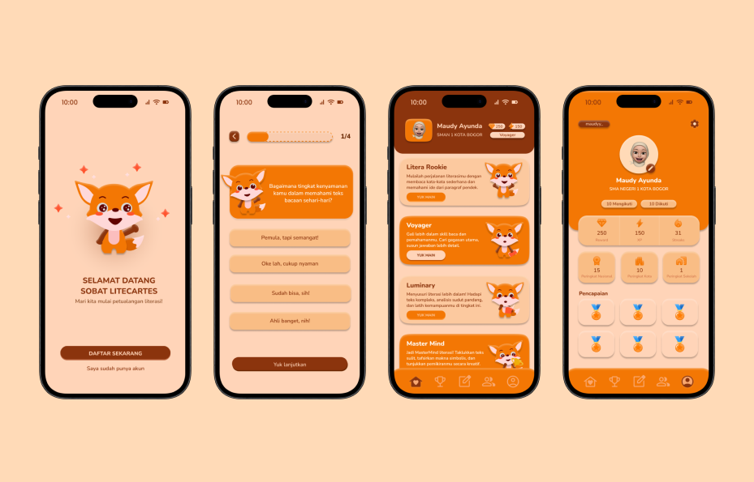

# Litecartes



Litecartes is an application made to address Sustainable Development Goals point 4, Quality Education. With our gamification application product, we aim to increase the literacy level and critical thinking of the future generations

## Team Members
#### Team Name : ```Kusushi```

Name | Role
-- |--
Devan Ferrel | Hacker
I Gusti Ngurah Ryo Adi Tarta | Hacker
Wilson Hamonangan Ariyanto Hutapea  | Hustler
Sarah Safira Millati | Hipster

## Setup
To setup litecartes application client side and server side, you can follow the instructions bellow

1. Clone this repository with command, the following command will also clone all submodules needed for the application
```zsh
git clone --recurse-submodules https://github.com/devanfer02/Litecartes.git
```

2. Change to the cloned repo directory with command
```zsh
cd Litecartes
```

3. Now you will see 2 folders for our application, ```litecartes-be``` and ```litecartes-frontend```

4. To make installation easier, you can use ```init.sh``` bash script to install all needed dependancies (npm, go) and configure the rest

5. Make sure you already make the bash script executeable with the following command 
```zsh
chmod +x init.sh
```

6. After making it executeable, you can run it with command
```zsh
./init.sh
```

7. If you are scared to use the script, you can go to each directory and follow the README.md manual

8. After running the bash script, configure the rest in ```litecartes-be``` and ```litecartes-frontend``` directory

## API Documentation
To read more info about server side API Documentation, you can go through the following [documentation](./litecartes-be/docs/DOCUMENTATION.md)
